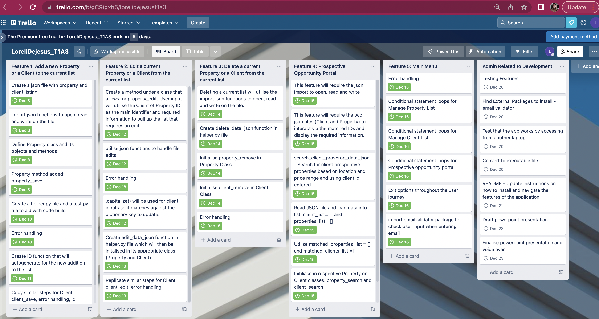

# LoreliDejesus_T1A3 - Real Estate App Idea (for Sellers)

The *RealSeller* app is designed to aid sellers working in the real estate industry:

* To manage their growing Client and Property lists 
* To increase efficiency by automating the Client-to-Property match (and vice versa) based on requirements specified

With overall objective of increasing seller profitability through the help of the app. 

____
**R1: Answers to all the documentation requirements below.**

Completed all R1-R8 notes with headers below.

____

**R2: Readme. separate heading for each documentation requirement and answers organised under the appropriate headings.**

Completed all R1-R8 notes with headers below.

___

**R4: Provide full attribution to referenced sources (where applicable).**

References correctly referenced in this README and in the Deck Presentation.

- CS Dojo (2018). Introduction to Classes and Objects - Part 1 (Data Structures & Algorithms #3). Retrieved on the 21st of December 2022 from https://www.youtube.com/watch?v=8yjkWGRlUmY

- Nyingi, J. (2019) Setting Up PEP8 and Pylint on VS Code. Retrieved on the 21st of December 2022 from https://dev.to/j0nimost/setting-up-pep8-and-pylint-on-vs-code-34h

- Van Rossum, G., Warsaw, B. and Coghlan, N. (2011). PEP 8 – Style Guide for Python Code. Retrieved on the 21st of December 2022 from https://peps.python.org/pep-0008/

___

**R4: Provide a link to your source control repository**

[Loreli De Jesus Github Repository](https://github.com/DJ-Lor/LoreliDejesus_T1A3)

[Loreli De Jesus Github Deck Presentation](https://github.com/DJ-Lor/LoreliDejesus_T1A3)
___

**R5: Identify any code style guide or styling conventions that the application will adhere to. Reference the chosen style guide appropriately.**

For my coding development, I utilised the PEP8 style guide Guido van Rossum, Barry Warsaw and Nick Coghlan (https://peps.python.org/pep-0008/). Consistency is key and I ensured that I remained consistent in my coding and utilised the style guidelines. A summary of the specific guidelines I followed in my code are as follows:

- Indentation and Spacing: Used 4 spaces per indentation level. No extra white spaces in place where they do not need to be. Surround top-level function and class definitions with two blank lines.

- Maximum line length: Limited all lines to a maximum of 79 characters. This is to ensure that different window views are able to maximise readability for my code. 

- Imports: Imports are grouped in the following order: standard library imports, related third party imports.Local application/library specific imports.

- Naming conventions: followed the lower_case_with_underscores structure and a capital letter start for class names. 

- Try & Except: When catching exceptions, I mentioned specific exceptions whenever possible instead of using a bare except.

- Boolean comparison: used 'is' vs '==', so for example instead of saying 'if x == True', I wrote it as 'if x is True'

- Consistent use of '' for the required code (vs " "). 

- Very long input: Utilised """ """ to work around spacing and ensuring I abide with the 79 character maximum line length. 

As additional step, I utilised pylint package to highlight and identifying programming errors that do not abide with the PEP8 style. (https://code.visualstudio.com/docs/python/linting). 

___

**R6: Develop a list of features that will be included in the application. It must include: (1) at least THREE features (2) describe each feature**


1. Feature 1: Add a new Property or a Client to the current list

    * The ability to add a new Property or Client details to the current json file list.  

    * There is a current list maintained in json file for each Client and Property list.

    * There will be two main classes utilised, namely Client and Property classes.

    * User input required for each detail (example: Suburb or Price) to be added to the file(json). Code handling will use the json import to utilise the file as intended. 

    * There will be a Client or Property ID that will be generated. This will be explained in detail in the latter part of the readme document. 

    * A confirmation of the new Client or Property details will be shown to the user and confirmed saved. This is utilising the classes for each. 

    * Option asked if the user would like to go back to the main menu or exit. 

2. Feature 2: Edit a current Property or a Client from the current list

    * The ability to edit current Property or Client details from the json file list.  

    * Editing a current list will utilise the import json functions to open, read and write on the file. 

    * User input will utilise the Client of Property ID as the main identifier and required information to pull up the list that requires an edit. 

    * Only the following options are editable per file:

            - Client_list.json header = name, email, suburb, price 
            - Property_list.json header = suburb, price 


    * A .lower() will be used for inputs so it matches against the dictionary key to update (which are all in lower case).

    * A confirmation of the update done will be displayed.

    * Option asked if the user would like to go back to the main menu or exit. 


3. Feature 3: Delete a current Property or a Client from the current list

    * The ability to delete a current Property or Client from the current json file list.  

    * Deleting a current list will utilise the import json functions to open, read and write on the file. 

    * User input will utilise the Client of Property ID as the main identifier and required information to pull up the list that requires deletion. 

    * The Client or Property information will be displayed to confirm if the user would like to proceed with the deletion.

    * A confirmation of the update done will be displayed.

    * Option asked if the user would like to go back to the main menu or exit. 

4. Feature 4: Prospective Opportunity Portal (Client-to-Property match (and vice versa) based on requirements specified

    * Able to Pick a Client ID or Property ID and will provide a list of available opportunities(Properties/Clients) within the given requirements.

    * Example 1: Inputted Client ID will output all the properties in that given suburb and priced less than or equal to that client's budget

    * Example 2: Inputted Property ID will output all the properties in that given suburb and priced equal to or more than the property's selling price

    * This feature will require the json import to open, read and write. 

    * This feature will require the two json files (client_list.json and property_list.json) to interact via the matched IDs and display the required information. In the instance of no matches, the program will specify that there are no matches. 


5. Feature 5: Main Menu 

    ***Main View***
    
    * Options shown and will require a user input to navigate the app 
        * Manage Property List
        * Manage Client List
        * Prospective Opportunity Portal
        * Exit
    
    * Navigating the terminal app experience requires usage of loops and conditional control statements in order to arrive to the chosen experience.

    * The main menu also utilises error handling through the helper.py and input_helper.py file to ensure that the app does not crash when user input deviates from the options required as input. 


6. Feature 6: ID generator 

    * The unique identifier for each Property or Client on the json lists.

    * The ID is 'auto-generated' via a function utilising a simple json file with a dictionary key ('id') and a value int starting from 100 (without a range limit). 

    * The code utilises the json import functions to interact with the file and add an increment of 1 for every new entry. 

    * This is then utilised in the respective Client and Property classes. 

    * Refer to code below: 

    ``` python
    def id_generate():

    with open('json_files/id.json', 'r') as openfile:
        # Reading from json file
        id_obj = json.load(openfile)
        (id_obj)["id"] = (id_obj)["id"]+1

    with open('json_files/id.json', 'w') as openfile:
        json.dump(id_obj, openfile, indent=4, separators=(',',': '))
    return ((id_obj)["id"])
    ```


____

**R7: Develop and utilise a suitable project management platform to track the app's implementation plan.**

* Utilised Trello's kanban approach by diving my tasks into main headers for (1) Features and (2) Admin related to development. 

* In each column, the specific tasks are outlined along with the estimated deadline for completion. 

* Target date of completion is located at the bottom right of each card. This is color coordinated. 

    * Green means done
    * Yellow means deadline is fast-approaching
    * Red means deadline has passed and is delayed





_____

**R8: Design help documentation which includes a set of instructions which accurately describe how to use and install the application.**

*You must include:*

**1. Steps to install the application**

TBC

**2. Any dependencies required by the application to operate**

* The correct terminal folder structure is required to ensure that the terminal app will work accordingly. Refer to the screenshot below: 

TBC

* The terminal app utilises a list of json files located in json_files folder (client_list.json, property_list.json, id.json) and will need these files in order for the app to function correctly. 


**3. Any system/hardware requirements**

* Venv virtual environment is utilised to ensure the app will run on all devices. 

**4. How to use any command line arguments made for the application**

Getting Started with RealSeller App! 

1. **Application Structure** - this section refers to the main app blueprint. This showcases the structure and options available to navigate the terminal application. 


* Opening the application will direct to the Main Menu options below:

        RealSeller App Main Menu:
        1. Manage Property List
                    1. Add New Property
                    2. Edit Current Property
                    3. Delete Property
                    4. Exit 
        2. Manage Client List
                    1. Add New Client
                    2. Edit Current Client
                    3. Delete Client
                    4. Exit 
        3. Prospective Opportunity Portal
                    1. Search by Client ID
                    2. Search by Property ID 
        4. Exit 

2. **Navigating the application** - this section discusses guidelines on how to navigate and interact with the application.

* General guideline

    * Only one entry can be done at a time. This means that if there is more than one Property or Client wanting to be added(or edited or deleted), this will have to be done one at a time. 


* Choosing an option from the menu.

    *If the menu options are *numerical*, please input or type the number only. 

        Example: To 'Add a new Property', please type '1' to choose this option. 
        
        Adding in stop such as '1.' or typing a string such as 'one' or '1abc' will result in an error message to try again. 

            Menu:
                        1. Add New Property
                        2. Edit Current Property
                        3. Delete Property
                        4. Exit 

    *If the menu options require a *Y/N*, please input the letter 'Y' for Yes and the letter 'N' for No. 

        Example: Would you like to proceed? Y/N: 

        Correct Answers: 'Y' or 'y' / 'N' or 'n' 
        
        Adding in stop such as 'Y.', spelling the answer 'Yes', or typing an integer such as '1' will result in an error message to try again. The application is not case sensitive and typing 'n' will be accepted for No. 

    
    *For all the 'EDIT' Property or Client options, please key in the text or the detail that needs editing. (This is the text positioned before the ':')

        Example: Which detail would you like to edit? 
        {'id': 105, 'suburb': 'randwick', 'price': '900000'}
        Enter here: 


        Only the following options are editable and are acceptable answers: 

        * name 
        * email
        * suburb
        * price 

        All other inputs that is not one of the above options will not be accepted and will be asked to try again. The application is not case sensitive. 

* A list of user input guidelines per item.

        1. id
            - Minimum 3-digit numeric number
            - Cannot be a string (example: 'abc' or '1b')

        2. suburb
            - Minimum 3-letter word
            - Can be a numeric 

        3. price
            - Needs to be an integer/numberic
            - Cannot be a string (example: 'abc' or '1b')

        4. name
            - Minimum 1-letter/digit as name
            - Can be a numeric 

        5. email 
            - Need to have the correct email formatting with 'user@example.com'


            


Notes:

11. Gitignore
13. should everything be under venv folder 


